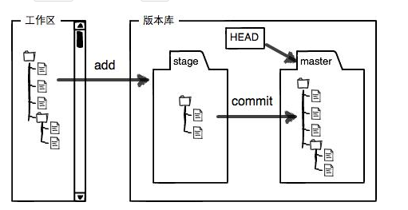

# git：分布式版本控制系统
<hr>

与集中式版本控制系统相比，分布式没用中央服务器，每个人电脑上都是一个完整的版本库。而集中式控制系统需要联网，需要中央服务器。此外git有强大的分支管理。

## 安装gitbash后，首先设置

```javascript
git config --global user.name ""
git config --global user.email ""
```

创建版本库:

```javascript
git init
```

把文件添加到仓库

```javascript
git add 文件
```

把文件提交到仓库

```javascript
git commit -m "修改备注"
```

## 版本控制:

```javascript
git status
```

命令可以让我们时刻掌握仓库当前的状态

```javascript
git diff
```

命令可以看到具体修改了哪些内容

### 版本回退

```javascript
git log
```

命令可以看版本历史记录（如果信息太多可以使用--pretty=oneline参数）

```javascript
git reset --hard
```

可以用来退回版本

* HEAD表示当前版本
* HEAD^ HEAD^^或HEAD~n来表示回退几个版本
* 也可以使用版本号，前几位即可

使用

```javascript
git reflog
```

记录每一次命令，可以查看历史版本号

### 工作区和暂存区

工作区就是在电脑里的目录，工作区内有一个隐藏目录.git，不算工作区，是版本库
版本库中存有暂存区，还有分支、以及指针HEAD



```javascript
git add
```

是将文件修改添加到暂存区

```javascript
git commit
```

是将暂存区的所有内容提交到当前分支

### 管理修改

```javascript
git diff HEAD -- name
```

可以查看工作区和版本库里面最新版本的区别

### 撤销修改

```javascript
git checkout -- name
```

可以丢弃工作区的修改

如果已经使用add提交到缓存区:

```javascript
git reset HEAD name
```

可以将暂存区的修改回退到工作区

### 删除文件

如果已经删除文件，这时有两种操作方法

```javascript
git rm name 直接删除
git checkout -- name 恢复
```

## 远程仓库

1. 创建SSH Key 在用户主目录下若有则省略2
1. ssh-keygen -t rsa -C "email"
1. 在用户主目录下找到id_rsa.pub将这个码添加到github的add ssh key上

### 添加到远程库

1. git remote add origin git@github.com:xx/xx.git 是将远程库和本地库关联
1. git push -u origin master 推送分支
1. 关联完毕再推送直接使用$ git push origin master

### 从远程库克隆

```javascript
git clone git@github.com:xx/xx.git
```

地址也可以使用`https://`

## 分支管理

### 创建与合并分支

```javascript
git checkout -b dev
```

-b是直接切换到新建分支，相当于

```javascript
git branch dev
git checkout dev
```

使用

```javascript
git branch
```

可以查看当前分支

```javascript
git merge dev
```

用于合并分支

```javascript
git branch -d dev
```

用于删除分支

合并分支可能会出现冲突，将自己的删除再add等
使用

```javascript
git log
```

可以看到分支的合并情况

```javascript
git log --graph
```

可以看到分支合并图

合并使用

```javascript
git merge --no--ff -m "zhushi" dev
```

可以禁用fast forward，留下分支信息

### 保留现场

```javascript
git stash
```

可以用来保留现场

```javascript
git stash list
```

用来查看现场

```javascript
git stash apply
```

用来恢复现场

```javascript
git stash drop
```

用于删除已

```javascript
git stash pop
```

回复现场并删除stash内容

```javascript
git stash apply stash@{0}
```

恢复指定现场

### 多人协作

```javascript
git remote
```

查看远程库信息

更详细

```javascript
git remote -v
```

克隆后克隆分支

```javascript
git checkout -b dev origin/dev
```

推送分支

```javascript
git push origin dev
```

冲突后使用

```javascript
git pull 把最新提交从origin/dev 抓下来
```

如果pull失败

```javascript
git branch --set-upstream dev origin/dev
```

然后再pull