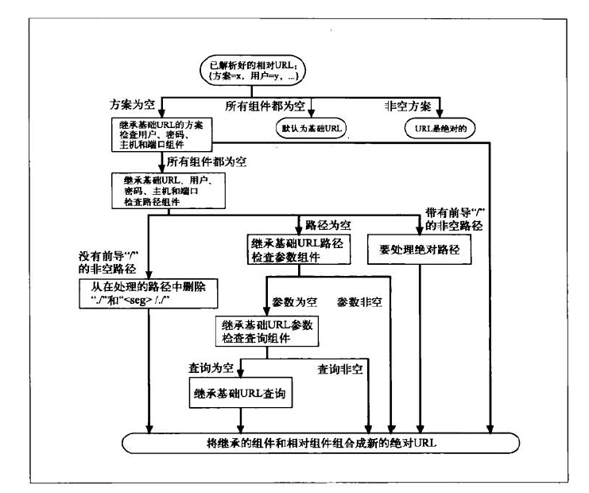
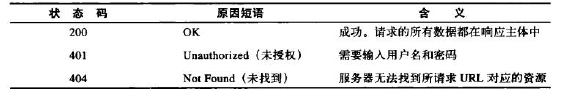
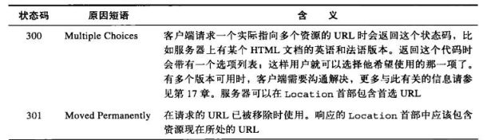
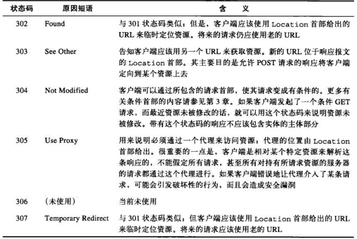
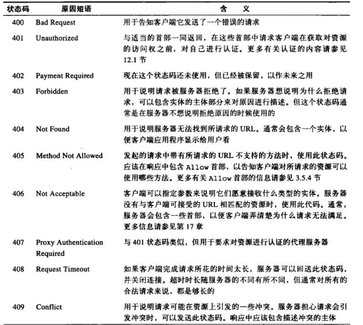
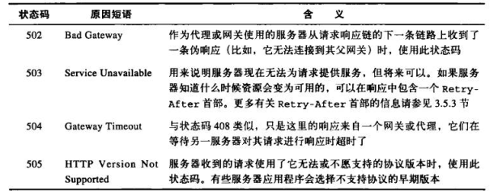

# HTTP-note

---

## URL

*URI*（Uniform Resource Identifier，统一资源标识符）是一类更通用的资源标识符，有两个主要的子集*URL*（Uniform Resource Locator，统一资源定位符）和*URN*（Uniform Resource Name，统一资源名称）构成，URL是通过描述资源的位置来标识资源的，而URN则是通过名字来识别资源的。

*URL*的组成分为 方案：//服务器位置/路径

### 组成

大多数*URL*方案的URL语法都建立在由9部分构成的通用格式上：

`<scheme>:<user>:<password>@<host>:<port>/<path>;<params>?<query>#<frag>`

#### scheme

必须以一个字母符号开始，由第一个：符号来将其与URL的其余部分分隔开来，是大小写无关的，例如`http://`

#### host port

提供主机ip地址和主机上的端口号

#### user password

如果使用的url方案要求输入用户名和密码，但是url没有，则浏览器会提供一个默认的用户名密码 如anonymous

#### path

说明了资源位于服务器的什么地方

#### params

由字符;将其与URL的其余部分分隔开来，为应用程序提供了访问资源所需的所有附加信息，参数名和值是键值对由等号分隔，参数间又;分隔

#### query

查询字符串，由？与其他部分分隔，同样为名值对，名值间用&分隔

#### frag

片段组件，用来表示资源的内部片段，例如：可以指向HTML文档中一个特定的图片或者小节
使用过#与其他部分分隔（服务器处理的是整个对象，url片段仅由客户端使用）

### URL快捷方式

基础url作为相对url的参考点使用的，可以来源于以下几个地方

1. 在资源中显示提供，如html中的`<base>`

1. 封装资源的基础URL

1. 没有基础URL，可能只是一个不完整或损坏了的URL



## HTTP报文

### 报文流

HTTP使用术语流入（inbound）和流出（outbound），来描述事务处理的方向，流入指报文流入到源服务器

### 报文向下游流动

所有报文都是向下游流动，所有报文的发送者都在接收者的上游。

### 报文的组成部分

每条报文都包含一条来自客户端的请求，或者一条来自服务器的响应。
都由三个部分组成：对报文进行描述的起始行（start line）、包含属性的首部（header）块、可选的包含数据的主体（body）部分

* 起始行和首部就是由行分隔的ASCII文本，每行都以一个由两个字符组成的终止序列作为结束，其中包含一个回车符和一个换行符，这个终止序列可以写作CRLF
* 报文的主体是一个可选的数据块，主体可以包含文本或二进制数据，也可以为空

### 报文语法

HTTP报文都可以分为两类：请求报文和响应报文

请求报文格式

```http
<method> <request-url> <version>
<headers>
<entity-body>
```

响应报文格式

```http
<version><status><reason-phrase>
<header>
<entity-body>
```

* method
  客户端希望服务器对资源执行的动作
  
  Head：可以用来在不获取资源的情况下了解资源的情况，如判断类型，查看状态码以确定资源是否存在，查看首部测试资源是否被修改

  PUT：方法的语义就是让服务器用请求的主体部分来创建一个由所请求的URL命名的新文档，若已存在则替代

  OPTIONS：为请求web服务器告知其支持的各种功能，支持的方法

  DELETE：请服务器删除请求URL所指定的资源

* request-url
  命名了所请求资源，或者URL路径组件的完整URL
* version
  报文所以使用的HTTP版本。如HTTP/\<major\>.\<minor\>
* status-code
  三位数字描述请求过程中所发生的情况
  
  
* reason-phrase
  status-code的可读版本
* header
  可以有0个或多个首部，每个首部都包含一个名字，后面跟一个冒号，然后是一个可选的空格，接着是一个值，最后是一个CRLF
* entity-body
  包含一个由任意数据组成的数据块

#### 首部

是一些名/值对的列表
分为 通用首部 请求首部 响应首部 实体首部 扩展首部
每个HTTP首部都有一种简单的语法：名字后面跟着冒号：，然后跟上可选的空格再跟上字段值，最后一个是CRLF
将首部行分为多行需要在多出来的每行前面加上至少一个空格和或者制表符


#### 实体的主体部分

是可选的，实体的主体是HTTP报文的负荷。就是HTTP要传输的内容

#### 方法

* GET是最常用的方法，用于请求服务器发送某个资源
* HEAD在服务器响应中只返回首部，不会返回实体的主体部分。这就可以在客户端未获取实际资源的情况下，对资源的首部进行检查。
* PUT会向服务器写入文档，不存在则创建新文档，存在则用这个主体替代它
* POST起初用来向服务器输入数据，实际上会用来支持HTML的表单。表单中填好的数据通常会被送给服务器，然后由服务器将其发送到它要去的地方。
* OPTIONS方法请求Web服务器告知其支持的各种功能，可以询问服务器通常支持哪些方法，或者对某些特殊资源支持哪些方法
* DELETE 就是请求服务器删除请求URL所指定的资源。（HTTP规范允许服务器在不通知客户端的情况下撤销请求）
* TRACE允许客户端在最终将请求发给服务器时，看看其变成什么样子，在请求行程的最后一站，服务器会弹出一条TRACE响应，并在响应主体中携带它收到的原始请求报文。这样客户端就可以查看在所有中间HTTP应用程序组成的请求/响应链上，原始报文是否以及如何被毁坏或修改过

#### 状态码






